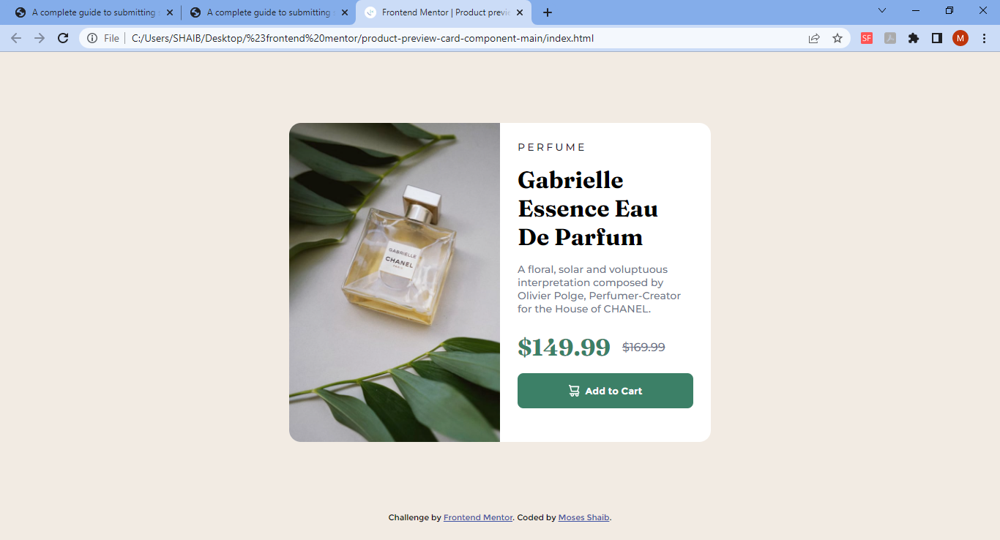
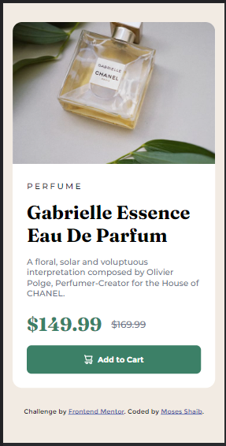

# Frontend Mentor - Product preview card component solution

This is a solution to the [Product preview card component challenge on Frontend Mentor](https://www.frontendmentor.io/challenges/product-preview-card-component-GO7UmttRfa). Frontend Mentor challenges help you improve your coding skills by building realistic projects.

## Table of contents

- [Overview](#overview)
  - [The challenge](#the-challenge)
  - [Screenshot](#screenshot)
  - [Links](#links)
- [My process](#my-process)
  - [Built with](#built-with)
  - [What I learned](#what-i-learned)
  - [Continued development](#continued-development)
- [Author](#author)

**Note: Delete this note and update the table of contents based on what sections you keep.**

## Overview

### The challenge

Users should be able to:

- View the optimal layout depending on their device's screen size
- See hover and focus states for interactive elements

### Screenshot

This is the screenshot of the desktop design for my code: 

And here's is the mobile: 

### Links

- Solution URL: [Add solution URL here](https://your-solution-url.com)
- Live Site URL: [Add live site URL here](https://your-live-site-url.com)

## My process

### Built with

- Semantic HTML5 markup
- CSS custom properties
- Flexbox
- Mobile-first workflow

### What I learned

I learnt that this piece of CSS code could help make the click on the screen feel like an actual click on a button:

```css
button {
  position: relative;
  ...
  transition: all 0.3s ease-in-out;
}
button:hover {
  background-color: hsl(158, 36%, 10%);
}
button:active {
  top: 1px;
}
```

### Continued development

I will love to improve my CSS layout skills using FlexBox module. And I want to improve my semantic markup that could improve my CSS.

## Author

- Frontend Mentor - [@ShaibMO](https://www.frontendmentor.io/profile/ShaibMO)
- Twitter - [@shaib_mosesO](https://www.twitter.com/shaib_mosesO)
